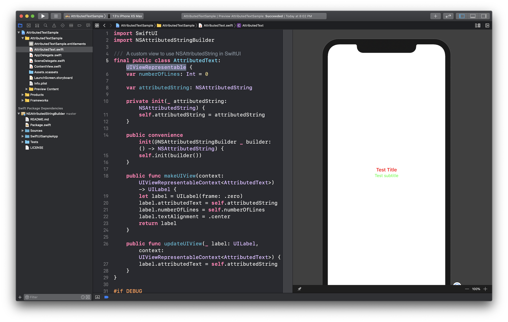
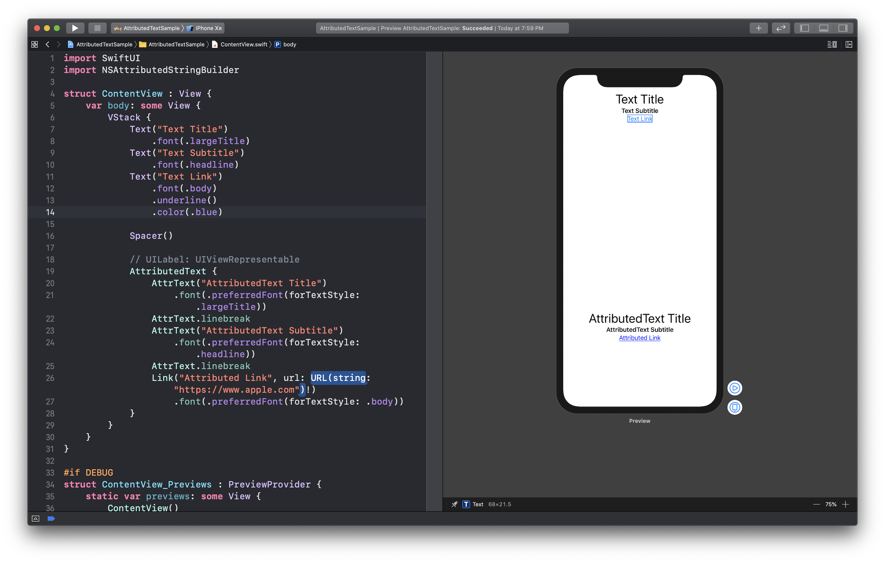

# NSAttributedStringBuilder
[](https://travis-ci.org/ethanhuang13/NSAttributedStringBuilder)
[](https://codecov.io/gh/ethanhuang13/NSAttributedStringBuilder)
[]()

[](https://github.com/ethanhuang13/ladybug/blob/master/LICENSE)
[](https://twitter.com/ethanhuang13)
[](https://paypal.me/ethanhuang13) 

Composing `NSAttributedString` with SwiftUI-style syntax, powerd by the now pitching [Function Builder](https://forums.swift.org/t/function-builders/25167).

Project Link: [https://github.com/ethanhuang13/NSAttributedStringBuilder](https://github.com/ethanhuang13/NSAttributedStringBuilder)

## Features

| | Features |
| --- | --- |
| 🐦 | Open source library written in Swift 5 |
| 🍬 | SwiftUI-like syntax |
| 💪 | Support most attributes in `NSAttributedString.Key` |
| 📦 | Distribution with Swift Package Manager |
| 🧪 | Fully tested code |

## How to use?

Traditionally we compose a `NSAttributedString` like this:

```Swift
let mas = NSMutableAttributedString(string: "")
mas.append(NSAttributedString(string: "Hello world", attributes: [.font: UIFont.systemFont(ofSize: 24), .foregroundColor: UIColor.red]))
mas.append(NSAttributedString(string: "\n"))
mas.append(NSAttributedString(string: "with Swift", attributes: [.font: UIFont.systemFont(ofSize: 20), .foregroundColor: UIColor.orange]))

```
Now, with **NSAttributedStringBuilder**, we can use SwiftUI-like syntax to declare `NSAttributedString`:

```Swift
let attributedString = NSAttributedString {
    AText("Hello world")
        .font(.systemFont(ofSize: 24))
        .foregroundColor(.red)
    LineBreak()
    AText("with Swift")
        .font(.systemFont(ofSize: 20))
        .foregroundColor(.orange)
}

```

## Requirements
Xcode 11 beta 4, iOS 13, macOS 10.15, tvOS 13, or watchOS 13, because it uses Swift 5.1 features like [Function Builder](https://forums.swift.org/t/function-builders/25167).

## Installation
Please use **Swift Package Manager** to install. 

Open your project in Xcode 11, navigate to **Menu -> Swift Packages -> Add Package Dependency** and enter [https://github.com/ethanhuang13/NSAttributedStringBuilder](https://github.com/ethanhuang13/NSAttributedStringBuilder) to install.

## SwiftUI Sample Project
Besides clearer `NSAttributedString` syntax, since **NSAttributedStringBuilder** uses Function Builder it also enables API to build components in `UIViewRepresentable`(which embbed `UIView` in a SwiftUI `View`).

Just like a SwiftUI `Text` takes a `String` as input, the purpose of `AttributedText` in the sample project is to take a `NSAttributedString` as input and render in SwiftUI.

To achieve this, `AttributedText.swift` uses `@NSAttributedStringBuilder` to support SwiftUI-style syntax:



Then using an `AttributedText` will be like:


Open the sample in ***/SwiftUISampleApp/AttributedTextSample.xcodeproj*** and check `AttributedText`. It uses `UITextView`, you can also use `UILabel` or `NSTextView`. 

## TODO
* Better tests for image attachment

## Known Issue
* `NSAttributedString` does not support link color, therefore `Link` component with a `.color()` modifier has no effect. Alternatively you need to specify in `UITextView.linkTextAttributes` or `.tintColor`. 

## Others
Initially discussed on this [Twitter thread](https://twitter.com/ethanhuang13/status/1148135534826442752). Some code are inspired by [zonble](https://github.com/zonble/NSAttributedStringBuilder)🙏.
